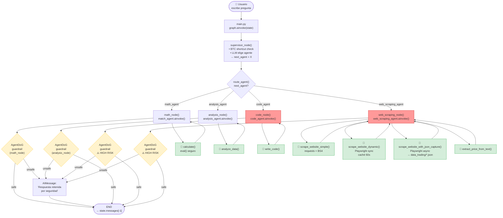

# Diagrama de Ejecución del Sistema Multi-Agentes

## Notas

- **Rojo**: nodos `HIGH_RISK` — `code_node` y `web_scraping_node` siempre son evaluados por AgentDoG
- **Amarillo**: guardrail AgentDoG — evalúa la trayectoria completa (tool_calls + observaciones) post-ejecución
- **Verde**: herramientas disponibles para cada agente
- Los agentes van directo a `END`, no regresan al supervisor
- El supervisor tiene un shortcut para preguntas de precio BTC que bypasea el LLM
- `scrape_website_with_json_capture` guarda automáticamente en `data_trading/`
