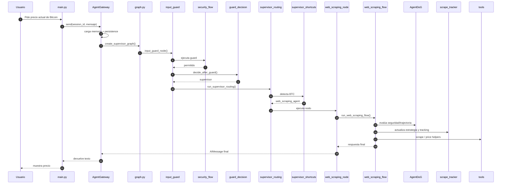

# Flujo visual: precio actual de Bitcoin

## Recorrido alto nivel

```mermaid
flowchart TD
  U[Usuario: "Dame el precio actual de Bitcoin"] --> M[main.py]
  M --> G[application.services.session_gateway.AgentGateway]
  G --> P1[infra.persistence / infra.memory]
  G --> C[application.composition.graph.create_supervisor_graph]
  C --> IG[input_guard_node]
  IG --> S[application.policies.security_flow.input_guard]
  S --> D[application.use_cases.guard_decision]
  D --> R[application.use_cases.supervisor_routing]
  R --> SC[application.use_cases.supervisor_shortcuts]
  SC -->|BTC detectado| WN[nodes.web_scraping_node]
  WN --> HITL[application.policies.hitl_flow]
  WN --> WF[application.use_cases.web_scraping_flow]
  WF --> AG[application.policies.agentdog]
  WF --> ST[application.policies.scrape_tracker]
  WF --> H[application.helpers.*]
  WF --> T[tools/*]
  WF --> A[Respuesta final]
  A --> G
  G --> P2[persistence + memory distillation]
```

## Secuencia detallada



## Áreas que intervienen

- **Entrada/CLI**: `main.py`
- **Sesiones + persistencia**: `application.services.session_gateway`, `infra.persistence`, `infra.memory`
- **Composición**: `application.composition.graph`
- **Seguridad de entrada**: `application.policies.security_flow`
- **Decisión de flujo**: `application.use_cases.guard_decision`, `routing_decision`, `supervisor_shortcuts`
- **Supervisor**: `application.use_cases.supervisor_chain`, `supervisor_routing`
- **Scraping**: `nodes.web_scraping_node`, `application.use_cases.web_scraping_flow`
- **Guardrails**: `application.policies.agentdog`, `application.policies.scrape_tracker`, `application.policies.hitl_flow`
- **Helpers compartidos**: `application.helpers.*`
- **Herramientas**: `tools/*`

## Qué pasa en este caso

La clave es que la frase contiene **Bitcoin/BTC**, entonces el supervisor activa el **fast path** y deriva directamente a `web_scraping_agent`, evitando routing innecesario. Después, el flujo de scraping consulta precio público, aplica guardrails y devuelve una respuesta final corta y limpia.
